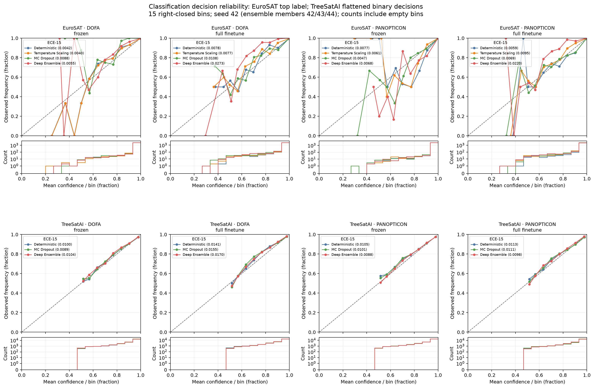
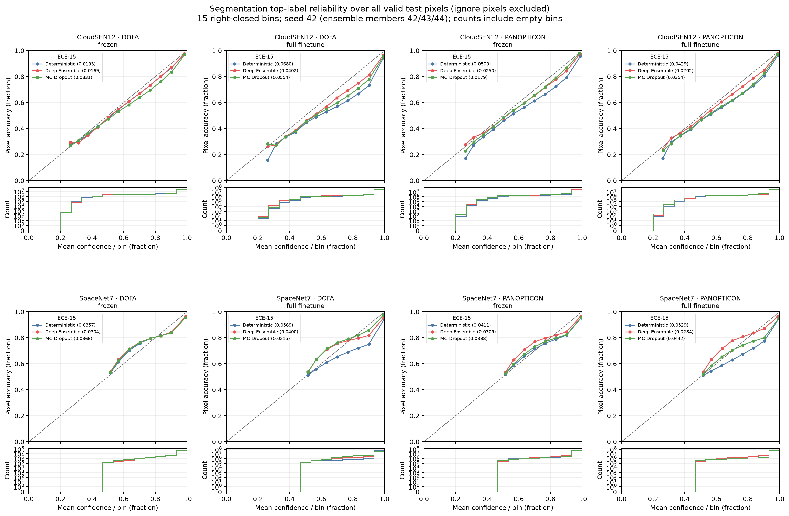
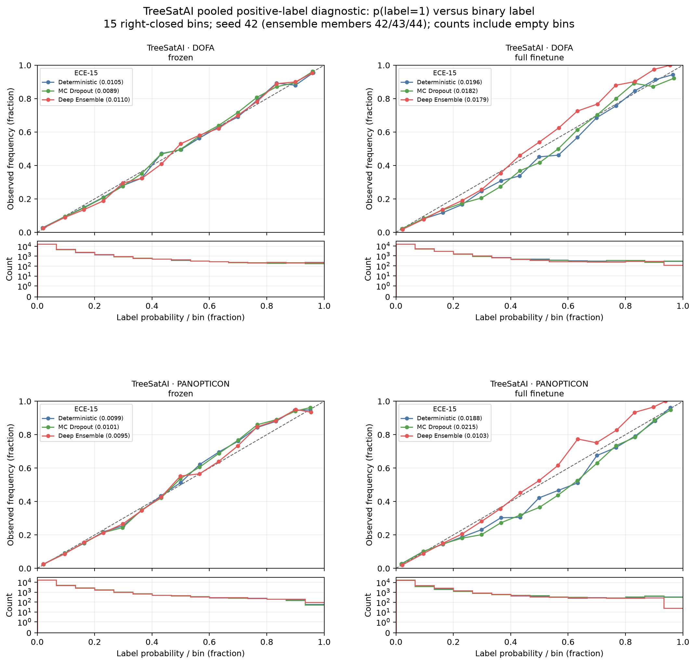
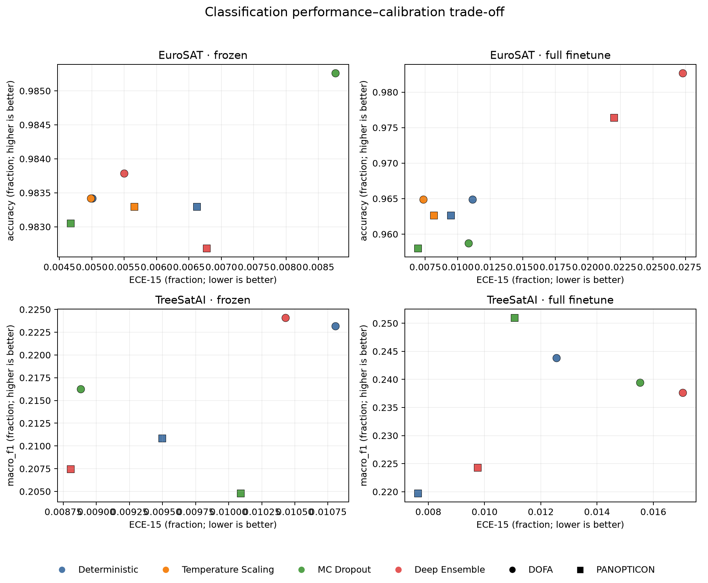
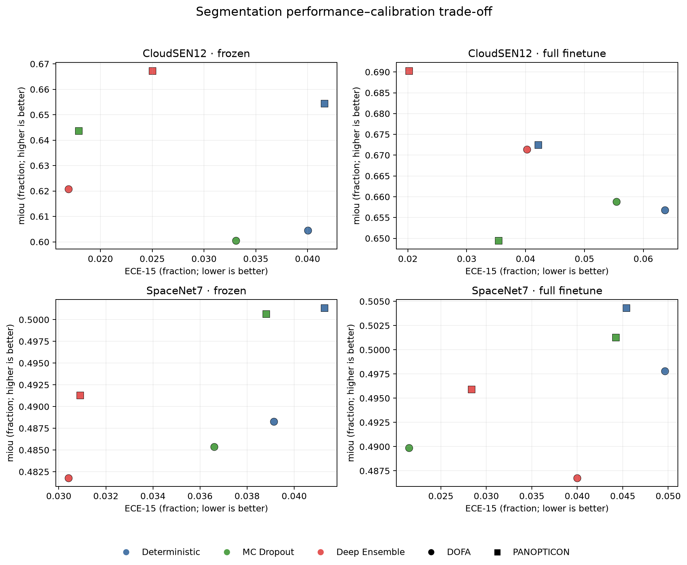
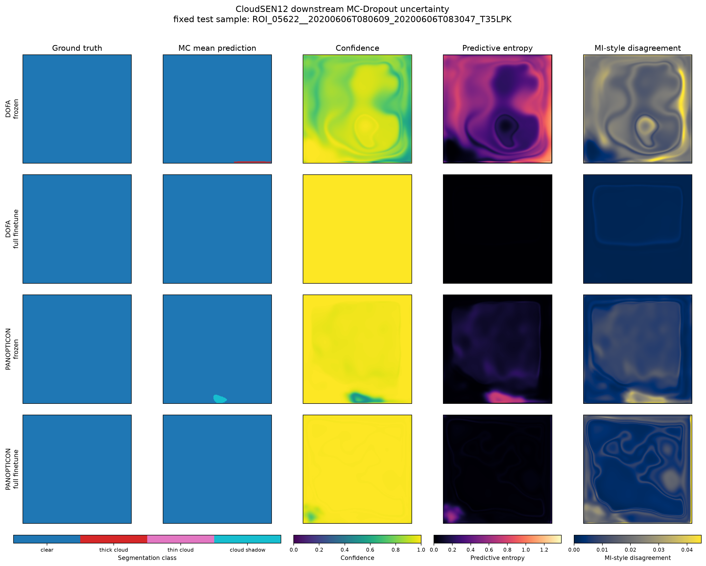
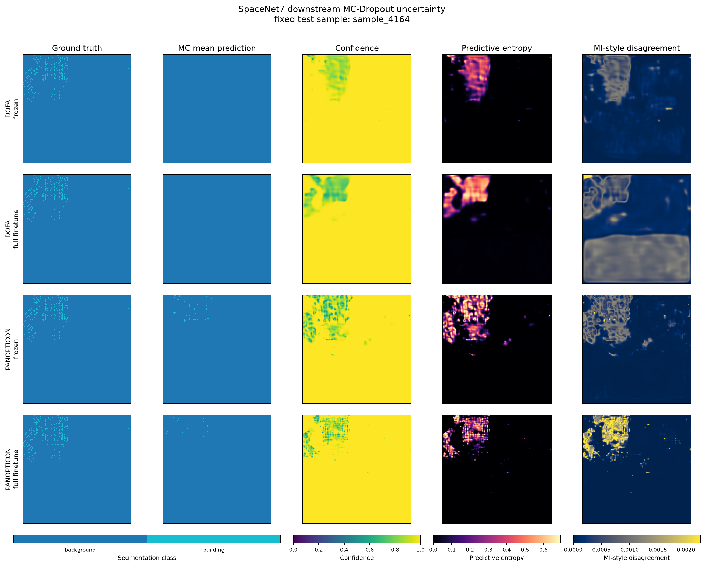

# Final Thesis Results Package

Completion entry point: [audit closure](../COMPLETION_REPORT.md), [RQ results section](../RESULTS_SECTION.md), and [24 same-checkpoint deterministic/dropout-off/MC comparisons](../mc_dropout_three_way.csv). The core tables below retain the frozen MC-versus-original-deterministic reporting matrix; the linked supplement isolates the fixed-weight inference effect.

This package contains only results admitted by the frozen C1–C5 validation and promotion audits. No model was trained and no model inference was run for C6; C6 only aggregates saved metrics/predictions and renders figures.

## Reporting rules

- Deterministic and Temperature-Scaling rows are mean ± sample standard deviation over seeds 42/43/44.
- Deep Ensemble is one separate three-member probability-mean result. It is never pooled into member mean ± std.
- The MC-Dropout main matrix is the predeclared seed-42 paired result with 30 probability passes. Three-seed MC robustness is reported separately for only the four predeclared cells.
- Core Temperature Scaling is applicable only to EuroSAT, fitted on its dedicated calibration split. TreeSatAI and segmentation are N/A according to the authoritative master matrix and dated freeze; all historical TreeSatAI TS results are preserved separately below.
- Segmentation Temperature Scaling is outside the frozen protocol and is reported as N/A, not missing.
- TreeSatAI accuracy is strict exact match across the 15-label vector; Macro-F1 is the primary task performance view. Its ECE flattens all binary decisions: confidence=max(p,1-p), outcome=correctness at threshold 0.5. Its NLL/Brier average sample-label decisions. EuroSAT uses top-label ECE, multiclass NLL and class-summed Brier.
- Metrics are fractions, not percentages; NLL is in nats. Segmentation multiclass Brier sums classes before averaging valid pixels. Positive-label reliability is a separate diagnostic and is not the main decision ECE.

## Classification results

### EuroSAT

| Model | Adaptation | UQ | Seeds/basis | Accuracy | Macro-F1 | NLL | Brier | ECE-15 | Status |
|---|---|---|---|---:|---:|---:|---:|---:|---|
| DOFA | frozen | Deterministic | 42;43;44 | 0.9834 ± 0.0006 | 0.9823 ± 0.0007 | 0.0544 ± 0.0039 | 0.0260 ± 0.0015 | 0.0050 ± 0.0019 | COMPLETE |
| DOFA | frozen | Temperature Scaling | 42;43;44 | 0.9834 ± 0.0006 | 0.9823 ± 0.0007 | 0.0544 ± 0.0039 | 0.0260 ± 0.0015 | 0.0050 ± 0.0022 | COMPLETE |
| DOFA | frozen | MC Dropout | 42 | 0.9853 | 0.9844 | 0.0497 | 0.0246 | 0.0088 | COMPLETE |
| DOFA | frozen | Deep Ensemble | 42;43;44 | 0.9838 | 0.9827 | 0.0520 | 0.0247 | 0.0055 | COMPLETE |
| DOFA | full_finetune | Deterministic | 42;43;44 | 0.9649 ± 0.0054 | 0.9637 ± 0.0055 | 0.1069 ± 0.0203 | 0.0533 ± 0.0082 | 0.0111 ± 0.0049 | COMPLETE |
| DOFA | full_finetune | Temperature Scaling | 42;43;44 | 0.9649 ± 0.0054 | 0.9637 ± 0.0055 | 0.1041 ± 0.0178 | 0.0527 ± 0.0077 | 0.0073 ± 0.0004 | COMPLETE |
| DOFA | full_finetune | MC Dropout | 42 | 0.9587 | 0.9569 | 0.1257 | 0.0636 | 0.0108 | COMPLETE |
| DOFA | full_finetune | Deep Ensemble | 42;43;44 | 0.9827 | 0.9823 | 0.0640 | 0.0305 | 0.0273 | COMPLETE |
| PANOPTICON | frozen | Deterministic | 42;43;44 | 0.9833 ± 0.0004 | 0.9826 ± 0.0005 | 0.0505 ± 0.0036 | 0.0256 ± 0.0009 | 0.0066 ± 0.0026 | COMPLETE |
| PANOPTICON | frozen | Temperature Scaling | 42;43;44 | 0.9833 ± 0.0004 | 0.9826 ± 0.0005 | 0.0495 ± 0.0029 | 0.0254 ± 0.0008 | 0.0057 ± 0.0017 | COMPLETE |
| PANOPTICON | frozen | MC Dropout | 42 | 0.9831 | 0.9823 | 0.0487 | 0.0248 | 0.0047 | COMPLETE |
| PANOPTICON | frozen | Deep Ensemble | 42;43;44 | 0.9827 | 0.9820 | 0.0478 | 0.0249 | 0.0068 | COMPLETE |
| PANOPTICON | full_finetune | Deterministic | 42;43;44 | 0.9627 ± 0.0073 | 0.9607 ± 0.0082 | 0.1126 ± 0.0374 | 0.0558 ± 0.0136 | 0.0095 ± 0.0050 | COMPLETE |
| PANOPTICON | full_finetune | Temperature Scaling | 42;43;44 | 0.9627 ± 0.0073 | 0.9607 ± 0.0082 | 0.1116 ± 0.0331 | 0.0556 ± 0.0132 | 0.0082 ± 0.0012 | COMPLETE |
| PANOPTICON | full_finetune | MC Dropout | 42 | 0.9580 | 0.9556 | 0.1221 | 0.0642 | 0.0069 | COMPLETE |
| PANOPTICON | full_finetune | Deep Ensemble | 42;43;44 | 0.9764 | 0.9753 | 0.0726 | 0.0364 | 0.0220 | COMPLETE |

### TreeSatAI

| Model | Adaptation | UQ | Seeds/basis | Accuracy | Macro-F1 | NLL | Brier | ECE-15 | Status |
|---|---|---|---|---:|---:|---:|---:|---:|---|
| DOFA | frozen | Deterministic | 42;43;44 | 0.2567 ± 0.0015 | 0.2232 ± 0.0037 | 0.2558 ± 0.0007 | 0.0740 ± 0.0002 | 0.0108 ± 0.0009 | COMPLETE |
| DOFA | frozen | Temperature Scaling | N/A | N/A | N/A | N/A | N/A | N/A | N/A |
| DOFA | frozen | MC Dropout | 42 | 0.2550 | 0.2162 | 0.2562 | 0.0743 | 0.0089 | COMPLETE |
| DOFA | frozen | Deep Ensemble | 42;43;44 | 0.2605 | 0.2241 | 0.2538 | 0.0735 | 0.0104 | COMPLETE |
| DOFA | full_finetune | Deterministic | 42;43;44 | 0.2668 ± 0.0028 | 0.2438 ± 0.0124 | 0.2469 ± 0.0030 | 0.0717 ± 0.0010 | 0.0126 ± 0.0039 | COMPLETE |
| DOFA | full_finetune | Temperature Scaling | N/A | N/A | N/A | N/A | N/A | N/A | N/A |
| DOFA | full_finetune | MC Dropout | 42 | 0.2825 | 0.2394 | 0.2479 | 0.0715 | 0.0155 | COMPLETE |
| DOFA | full_finetune | Deep Ensemble | 42;43;44 | 0.2740 | 0.2376 | 0.2376 | 0.0687 | 0.0170 | COMPLETE |
| PANOPTICON | frozen | Deterministic | 42;43;44 | 0.2378 ± 0.0029 | 0.2108 ± 0.0055 | 0.2570 ± 0.0021 | 0.0754 ± 0.0006 | 0.0095 ± 0.0009 | COMPLETE |
| PANOPTICON | frozen | Temperature Scaling | N/A | N/A | N/A | N/A | N/A | N/A | N/A |
| PANOPTICON | frozen | MC Dropout | 42 | 0.2380 | 0.2048 | 0.2584 | 0.0758 | 0.0101 | COMPLETE |
| PANOPTICON | frozen | Deep Ensemble | 42;43;44 | 0.2390 | 0.2075 | 0.2547 | 0.0747 | 0.0088 | COMPLETE |
| PANOPTICON | full_finetune | Deterministic | 42;43;44 | 0.2515 ± 0.0313 | 0.2198 ± 0.0244 | 0.2505 ± 0.0045 | 0.0732 ± 0.0016 | 0.0076 ± 0.0036 | COMPLETE |
| PANOPTICON | full_finetune | Temperature Scaling | N/A | N/A | N/A | N/A | N/A | N/A | N/A |
| PANOPTICON | full_finetune | MC Dropout | 42 | 0.2900 | 0.2510 | 0.2498 | 0.0729 | 0.0111 | COMPLETE |
| PANOPTICON | full_finetune | Deep Ensemble | 42;43;44 | 0.2655 | 0.2243 | 0.2417 | 0.0704 | 0.0098 | COMPLETE |

## Segmentation results

### CloudSEN12

| Model | Adaptation | UQ | Seeds/basis | mIoU | IoU clear | IoU thick cloud | IoU thin cloud | IoU shadow | Pixel acc. | NLL | Brier | ECE-15 | Status |
|---|---|---|---|---:|---:|---:|---:|---:|---:|---:|---:|---:|---|
| DOFA | frozen | Deterministic | 42;43;44 | 0.6044 ± 0.0037 | 0.8184 ± 0.0034 | 0.7463 ± 0.0049 | 0.3634 ± 0.0091 | 0.4897 ± 0.0016 | 0.8339 ± 0.0021 | 0.4733 ± 0.0112 | 0.2419 ± 0.0033 | 0.0400 ± 0.0179 | COMPLETE |
| DOFA | frozen | Temperature Scaling | N/A | N/A | N/A | N/A | N/A | N/A | N/A | N/A | N/A | N/A | N/A |
| DOFA | frozen | MC Dropout | 42 | 0.6005 | 0.8150 | 0.7440 | 0.3572 | 0.4856 | 0.8308 | 0.4648 | 0.2424 | 0.0331 | COMPLETE |
| DOFA | frozen | Deep Ensemble | 42;43;44 | 0.6207 | 0.8285 | 0.7585 | 0.3904 | 0.5056 | 0.8438 | 0.4246 | 0.2238 | 0.0169 | COMPLETE |
| DOFA | full_finetune | Deterministic | 42;43;44 | 0.6568 ± 0.0067 | 0.8494 ± 0.0059 | 0.7901 ± 0.0060 | 0.4366 ± 0.0049 | 0.5511 ± 0.0112 | 0.8625 ± 0.0047 | 0.4796 ± 0.0151 | 0.2122 ± 0.0048 | 0.0637 ± 0.0044 | COMPLETE |
| DOFA | full_finetune | Temperature Scaling | N/A | N/A | N/A | N/A | N/A | N/A | N/A | N/A | N/A | N/A | N/A |
| DOFA | full_finetune | MC Dropout | 42 | 0.6588 | 0.8532 | 0.7899 | 0.4349 | 0.5571 | 0.8644 | 0.4562 | 0.2066 | 0.0554 | COMPLETE |
| DOFA | full_finetune | Deep Ensemble | 42;43;44 | 0.6714 | 0.8586 | 0.8015 | 0.4536 | 0.5718 | 0.8709 | 0.3982 | 0.1920 | 0.0402 | COMPLETE |
| PANOPTICON | frozen | Deterministic | 42;43;44 | 0.6544 ± 0.0005 | 0.8507 ± 0.0016 | 0.7826 ± 0.0026 | 0.4521 ± 0.0007 | 0.5321 ± 0.0051 | 0.8603 ± 0.0010 | 0.4137 ± 0.0214 | 0.2061 ± 0.0040 | 0.0416 ± 0.0073 | COMPLETE |
| PANOPTICON | frozen | Temperature Scaling | N/A | N/A | N/A | N/A | N/A | N/A | N/A | N/A | N/A | N/A | N/A |
| PANOPTICON | frozen | MC Dropout | 42 | 0.6437 | 0.8424 | 0.7816 | 0.4319 | 0.5190 | 0.8548 | 0.3966 | 0.2073 | 0.0179 | COMPLETE |
| PANOPTICON | frozen | Deep Ensemble | 42;43;44 | 0.6673 | 0.8575 | 0.7910 | 0.4713 | 0.5494 | 0.8671 | 0.3658 | 0.1927 | 0.0250 | COMPLETE |
| PANOPTICON | full_finetune | Deterministic | 42;43;44 | 0.6725 ± 0.0037 | 0.8608 ± 0.0021 | 0.8000 ± 0.0037 | 0.4651 ± 0.0087 | 0.5640 ± 0.0025 | 0.8705 ± 0.0019 | 0.3881 ± 0.0150 | 0.1914 ± 0.0036 | 0.0422 ± 0.0038 | COMPLETE |
| PANOPTICON | full_finetune | Temperature Scaling | N/A | N/A | N/A | N/A | N/A | N/A | N/A | N/A | N/A | N/A | N/A |
| PANOPTICON | full_finetune | MC Dropout | 42 | 0.6494 | 0.8490 | 0.7835 | 0.4365 | 0.5288 | 0.8604 | 0.3961 | 0.2031 | 0.0354 | COMPLETE |
| PANOPTICON | full_finetune | Deep Ensemble | 42;43;44 | 0.6903 | 0.8706 | 0.8122 | 0.4929 | 0.5853 | 0.8798 | 0.3355 | 0.1747 | 0.0202 | COMPLETE |

### SpaceNet7

| Model | Adaptation | UQ | Seeds/basis | mIoU | IoU bg/building | Pixel acc. | NLL | Brier | ECE-15 | Building ECE | Classwise ECE bg/building | Foreground NLL/Brier | Boundary ECE | Status |
|---|---|---|---|---:|---:|---:|---:|---:|---:|---:|---:|---:|---:|---|
| DOFA | frozen | Deterministic | 42;43;44 | 0.4883 ± 0.0009 | 0.9244 ± 0.0021 / 0.0522 ± 0.0037 | 0.9247 ± 0.0021 | 0.3123 ± 0.0274 | 0.1307 ± 0.0032 | 0.0391 ± 0.0030 | 0.0465 ± 0.0050 | 0.0465 ± 0.0050 / 0.0465 ± 0.0050 | 0.3123 ± 0.0274 / 0.0654 ± 0.0016 | 0.1400 ± 0.0052 | COMPLETE |
| DOFA | frozen | Temperature Scaling | N/A | N/A | N/A / N/A | N/A | N/A | N/A | N/A | N/A | N/A / N/A | N/A / N/A | N/A | N/A |
| DOFA | frozen | MC Dropout | 42 | 0.4854 | 0.9268 / 0.0439 | 0.9271 | 0.2776 | 0.1273 | 0.0366 | 0.0412 | 0.0412 / 0.0412 | 0.2776 / 0.0637 | 0.1354 | COMPLETE |
| DOFA | frozen | Deep Ensemble | 42;43;44 | 0.4818 | 0.9298 / 0.0338 | 0.9299 | 0.2410 | 0.1215 | 0.0304 | 0.0320 | 0.0320 / 0.0320 | 0.2410 / 0.0608 | 0.1229 | COMPLETE |
| DOFA | full_finetune | Deterministic | 42;43;44 | 0.4978 ± 0.0016 | 0.9227 ± 0.0024 / 0.0729 ± 0.0056 | 0.9232 ± 0.0023 | 0.4701 ± 0.0788 | 0.1341 ± 0.0039 | 0.0496 ± 0.0064 | 0.0575 ± 0.0048 | 0.0575 ± 0.0048 / 0.0575 ± 0.0048 | 0.4701 ± 0.0788 / 0.0670 ± 0.0020 | 0.1682 ± 0.0183 | COMPLETE |
| DOFA | full_finetune | Temperature Scaling | N/A | N/A | N/A / N/A | N/A | N/A | N/A | N/A | N/A | N/A / N/A | N/A / N/A | N/A | N/A |
| DOFA | full_finetune | MC Dropout | 42 | 0.4899 | 0.9305 / 0.0493 | 0.9307 | 0.2192 | 0.1163 | 0.0215 | 0.0230 | 0.0230 / 0.0230 | 0.2192 / 0.0581 | 0.0892 | COMPLETE |
| DOFA | full_finetune | Deep Ensemble | 42;43;44 | 0.4868 | 0.9304 / 0.0431 | 0.9306 | 0.3212 | 0.1220 | 0.0400 | 0.0413 | 0.0413 / 0.0413 | 0.3212 / 0.0610 | 0.1406 | COMPLETE |
| PANOPTICON | frozen | Deterministic | 42;43;44 | 0.5013 ± 0.0015 | 0.9180 ± 0.0000 / 0.0846 ± 0.0030 | 0.9186 ± 0.0001 | 0.3549 ± 0.0009 | 0.1363 ± 0.0007 | 0.0413 ± 0.0002 | 0.0552 ± 0.0002 | 0.0552 ± 0.0002 / 0.0552 ± 0.0002 | 0.3547 ± 0.0010 / 0.0681 ± 0.0004 | 0.1461 ± 0.0022 | COMPLETE |
| PANOPTICON | frozen | Temperature Scaling | N/A | N/A | N/A / N/A | N/A | N/A | N/A | N/A | N/A | N/A / N/A | N/A / N/A | N/A | N/A |
| PANOPTICON | frozen | MC Dropout | 42 | 0.5007 | 0.9212 / 0.0802 | 0.9217 | 0.3173 | 0.1321 | 0.0388 | 0.0502 | 0.0502 / 0.0502 | 0.3173 / 0.0660 | 0.1347 | COMPLETE |
| PANOPTICON | frozen | Deep Ensemble | 42;43;44 | 0.4913 | 0.9289 / 0.0537 | 0.9292 | 0.2481 | 0.1209 | 0.0309 | 0.0340 | 0.0340 / 0.0340 | 0.2481 / 0.0605 | 0.1142 | COMPLETE |
| PANOPTICON | full_finetune | Deterministic | 42;43;44 | 0.5043 ± 0.0049 | 0.9156 ± 0.0038 / 0.0930 ± 0.0113 | 0.9164 ± 0.0037 | 0.4318 ± 0.0854 | 0.1412 ± 0.0047 | 0.0454 ± 0.0102 | 0.0596 ± 0.0047 | 0.0596 ± 0.0047 / 0.0596 ± 0.0047 | 0.4318 ± 0.0854 / 0.0706 ± 0.0023 | 0.1588 ± 0.0254 | COMPLETE |
| PANOPTICON | full_finetune | Temperature Scaling | N/A | N/A | N/A / N/A | N/A | N/A | N/A | N/A | N/A | N/A / N/A | N/A / N/A | N/A | N/A |
| PANOPTICON | full_finetune | MC Dropout | 42 | 0.5013 | 0.9225 / 0.0800 | 0.9231 | 0.4147 | 0.1313 | 0.0442 | 0.0541 | 0.0541 / 0.0541 | 0.4147 / 0.0656 | 0.1514 | COMPLETE |
| PANOPTICON | full_finetune | Deep Ensemble | 42;43;44 | 0.4959 | 0.9294 / 0.0625 | 0.9297 | 0.2604 | 0.1214 | 0.0284 | 0.0317 | 0.0317 / 0.0317 | 0.2604 / 0.0607 | 0.1175 | COMPLETE |

## MC-Dropout robustness subset

| Task | Dataset | Model | Adaptation | Seeds | Primary performance (accuracy / Macro-F1 / mIoU) | NLL | Brier | ECE-15 |
|---|---|---|---|---|---:|---:|---:|---:|
| classification | eurosat | DOFA | frozen | 42;43;44 | 0.9835 ± 0.0017 | 0.0545 ± 0.0041 | 0.0265 ± 0.0018 | 0.0081 ± 0.0034 |
| classification | treesatai | PANOPTICON | full_finetune | 42;43;44 | 0.2261 ± 0.0218 | 0.2475 ± 0.0023 | 0.0723 ± 0.0007 | 0.0076 ± 0.0031 |
| segmentation | cloudsen12 | PANOPTICON | frozen | 42;43;44 | 0.6490 ± 0.0049 | 0.3976 ± 0.0016 | 0.2042 ± 0.0027 | 0.0306 ± 0.0110 |
| segmentation | spacenet7 | DOFA | full_finetune | 42;43;44 | 0.4900 ± 0.0038 | 0.2856 ± 0.0697 | 0.1218 ± 0.0054 | 0.0344 ± 0.0117 |

## Reliability diagrams

Reliability curves use 15 equal-width right-closed bins (lo,hi], with 0 included in the first bin; empty bins retain count 0 and undefined means. Curves show seed 42, except the single ensemble of seeds 42/43/44. Histograms display every bin count (symlog count scale). Classification uses top-label confidence/correctness for EuroSAT and flattened binary-decision confidence/correctness for TreeSatAI. Segmentation pools all valid test pixels, excluding ignore pixels. Exact plotted bins and counts are saved alongside each PNG as CSV. Plot ECE is checked against the corresponding seed-level master metric.

The separate TreeSatAI figure pools p(label=1) against the binary label, including negative labels. This quantity differs from decision ECE and from the mean of 15 label-specific ECE values. Label-level diagnostics and 10/15/30-bin sensitivity are retained in the companion audit evidence linked below.

## Performance–calibration views

These plots are descriptive. They do not imply statistical significance or a single preferred operating point.

## Qualitative segmentation uncertainty

Each map uses the first ID from the prospectively fixed C4/C5 research subset, selected before stochastic results were inspected. Predictive entropy is descriptive; MI-style disagreement is an epistemic proxy and is not claimed to be true epistemic uncertainty. A common within-dataset 99.5th-percentile color cap is used only for visual comparability.

## Applicability and caveats

- All 8 classification cells have deterministic, MC Dropout and Deep Ensemble results. EuroSAT has 4 applicable TS cells; TreeSatAI has 4 N/A TS cells. All 12 N/A cells carry blank metrics rather than zeros.
- All 8 segmentation cells have deterministic, MC Dropout, and Deep Ensemble results; Temperature Scaling is N/A by design.
- SpaceNet7 boundary calibration uses valid boundary pixels only. Boundary-free per-image values remain undefined in the underlying archives.
- The C3 segmentation ensemble summary CSV omitted SpaceNet7 classwise-ECE columns. This package restores the already-computed values from each validated ensemble manifest; no new inference or metric estimation was performed.
- EuroSAT retains a frozen backend-specific preprocessing history: immutable DOFA comparators use their historical RGB normalization, whereas Panopticon uses the newer final train-statistics convention. Cross-model EuroSAT comparisons must retain this confound disclosure.
- Some full-finetuning learning curves deteriorate after the validation-selected optimum; final rows use only the frozen validation-selected best checkpoints.

## Machine-readable package

- `tables/classification_results.csv`
- `tables/segmentation_results.csv`
- `tables/mc_dropout_robustness.csv`
- `tables/method_applicability.csv`
- `tables/source_provenance.csv`
- `tables/package_manifest.json`

The package manifest pins source summaries, raw predictions used in figures, generator code, and generated tables/figures by SHA256. The complete seed-level master is copied into tables/thesis_master_results.csv; the MC robustness summary for four selected cells is distinct from the seed-42 display.

Further direct-prediction diagnostics from the completed audit: [classification class diagnostics](../../core_rq_audit_20260918/class_diagnostics.csv), [segmentation class diagnostics](../../core_rq_audit_20260918/segmentation_class_diagnostics.csv), [classification 10/15/30-bin tables](../../core_rq_audit_20260918/classification_reliability_bins.csv), [segmentation 10/15/30-bin tables](../../core_rq_audit_20260918/segmentation_reliability_bins.csv). SpaceNet7 building calibration evaluates building probability against the building indicator across all valid pixels, not only true-building pixels.

## Historical TreeSatAI temperature scaling: excluded from the core comparison

All 12 seed-level historical results, including adverse changes, are retained in [this table](tables/historical_treesatai_temperature_scaling.csv). Temperature was fitted on official validation, also used for checkpoint selection; test labels did not fit temperature. Such reuse does not by itself invalidate held-out evaluation. The exclusion follows the dated reporting policy, not a mathematical requirement for a separately named calibration split.

| Model | Adaptation | Seed | Temperature | Δ exact-match accuracy | Δ Macro-F1 | Δ NLL | Δ Brier | Δ decision ECE-15 |
|---|---|---:|---:|---:|---:|---:|---:|---:|
| dofa | frozen | 42 | 1.0852 | +0.000000 | +0.000000 | -0.000410 | +0.000178 | +0.001774 |
| dofa | frozen | 43 | 1.0278 | +0.000000 | +0.000000 | +0.000052 | +0.000091 | +0.000977 |
| dofa | frozen | 44 | 1.0150 | +0.000000 | +0.000000 | +0.000040 | +0.000051 | +0.000573 |
| dofa | full_finetune | 42 | 1.0278 | +0.000000 | +0.000000 | +0.000677 | +0.000167 | +0.003406 |
| dofa | full_finetune | 43 | 1.1199 | +0.000000 | +0.000000 | +0.000560 | +0.000277 | +0.004918 |
| dofa | full_finetune | 44 | 0.9921 | +0.000000 | +0.000000 | -0.000164 | -0.000041 | -0.000991 |
| panopticon | frozen | 42 | 1.0562 | +0.000000 | +0.000000 | +0.000466 | +0.000188 | +0.002496 |
| panopticon | frozen | 43 | 1.0671 | +0.000000 | +0.000000 | +0.000336 | +0.000176 | +0.002395 |
| panopticon | frozen | 44 | 1.0799 | +0.000000 | +0.000000 | +0.000023 | +0.000173 | +0.001871 |
| panopticon | full_finetune | 42 | 1.1487 | +0.000000 | +0.000000 | +0.000618 | +0.000378 | +0.004441 |
| panopticon | full_finetune | 43 | 1.0693 | +0.000000 | +0.000000 | +0.000373 | +0.000079 | +0.003910 |
| panopticon | full_finetune | 44 | 1.0318 | +0.000000 | +0.000000 | +0.000493 | +0.000111 | +0.003573 |

The sequence is explicit: **2026-08-24** historical TreeSatAI TS results were available (`reports/c3_treesatai_temperature_scaling.md`); **2026-08-25** the freeze excluded them from final core reporting (`reports/pre_uq_protocol_freeze.md`); **2026-08-26** the old C6 package still marked them COMPLETE (`reports/final_thesis_results.md`); **2026-08-27** the master/RQ3 tables followed the freeze and marked them N/A (`reports/thesis_master_results.csv`, `reports/rq3_uq_effects.csv`). Thus the TS exclusion was not registered before all TS outcomes were visible. This rebuilt package resolves the stale C6 conflict while preserving the old files. The prospective MC plan and historical TS reporting decision have different timelines. No motive for the exclusion is inferred.
